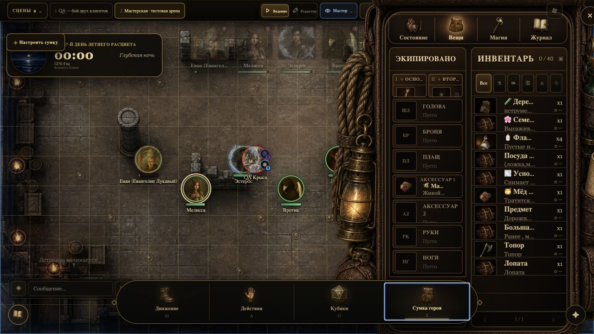
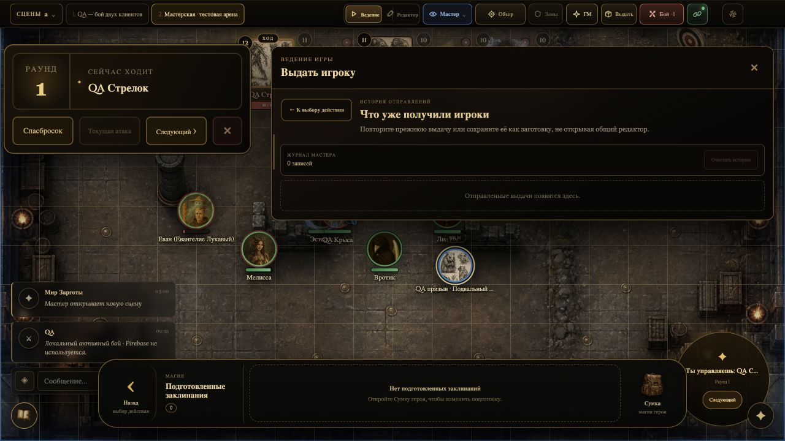
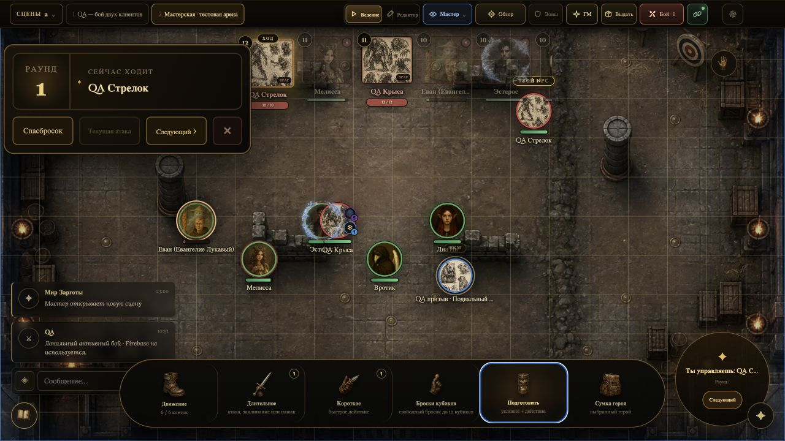
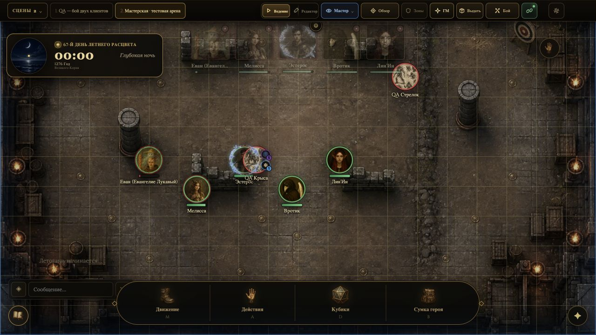
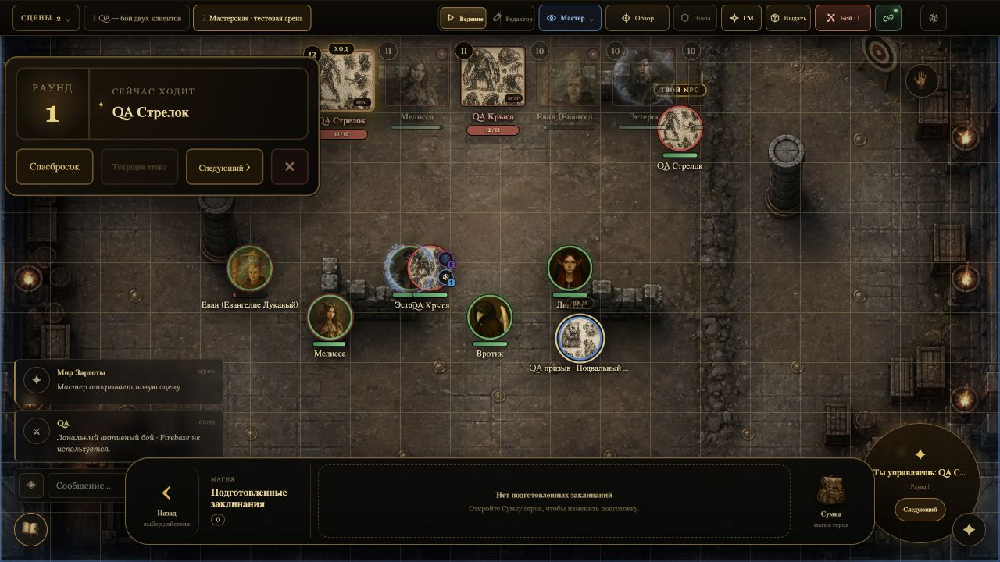
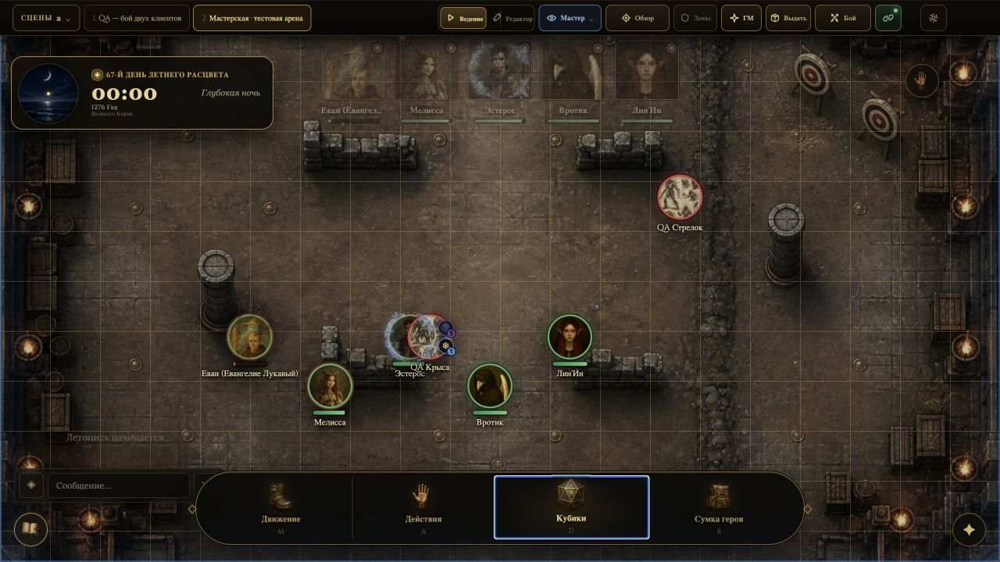

# Визуальный QA на утверждение — 13.08.2026

Этот документ отделяет подтверждённые функциональные ошибки от визуальных решений, где лучше сначала получить решение мастера. Автотесты и локальный живой прогон выполнены на `index.html?qa_scene=1&agent_test=rerun`.

## Уже исправлено — утверждение не требуется

### F-01. Открытая Сумка героя не переключалась на выбранного героя

Причина: обработчик токена пытался напрямую изменить приватное состояние другого интерфейсного модуля и падал с `ReferenceError: activePanel is not defined`.

Исправление: переключение вынесено в публичный адаптер канонической сумки. В живом прогоне содержимое открытой сумки переключилось с Евана на Мелиссу без закрытия окна и без нового исключения.

### F-02. Увеличенная сумка перекрывала нижний тулбар

Причина: открытая сумка имела слой выше тулбара; визуально кнопка была видна, но клик принимало содержимое сумки.

Исправление: при открытой сумке тулбар находится над ней, а кнопки настроек и пинга остаются выше обоих слоёв. Повторное нажатие на `Сумка героя` закрывает окно.

### F-03. Клики в окне выдачи во время боя

Проверено в активном локальном бою: окно открывается, после паузы между боевыми обновлениями кнопка `История отправлений` остаётся доступной и переводит в журнал выдач. Обнаруженного раньше пересоздания кнопки каждые примерно 300 мс в этом сценарии нет.

### F-04. Режим перемещения жетона не менял курсор

Причина: стиль выбранного жетона в режиме ведения имел более специфичное правило `context-menu` и перекрывал `grab`, хотя сам режим перемещения уже включался.

Исправление: временный режим `Переместить жетон` теперь явно получает курсор захвата и золотую рамку; обычный правый клик по-прежнему открывает меню, а случайный drag в режиме ведения не включён.

В текущем пакете скриншотов этот момент не приложен: исправление проверено
контрактом `gm-token-context-menu` и живым включением режима на сцене.

### F-05. Просмотр состояния с карты

Проверено: клик по значку состояния рядом с жетоном открывает карточку поверх карты и всех жетонов. Карточка показывает источник, оставшуюся длительность и описание механики; закрытие не меняет состояние персонажа.

Скриншот карточки состояния не включён в текущий пакет: поведение проверено
живым кликом и контрактами `status-display` / `status-combat-sync`.

### F-06. Кнопка «Сумка героя» закрывала открытый лист вместо перехода к вещам

Причина: переключатель считал открытой сумкой любой раздел канонического окна
героя. Поэтому после просмотра «Состояния» или листа нажатие `Сумка героя`
сразу закрывало окно.

Исправление: кнопка закрывает окно только при повторном нажатии, когда уже
открыт раздел `Вещи`. Из листа, магии или журнала она сначала переводит в
инвентарь выбранного героя. Контракт проверяет отдельно текущую панель и
фактически отрисованный `data-active-panel`.

### F-07. Верхний портрет не менял героя в уже открытой сумке

В живом бою воспроизведено: после открытия сумки Евана клик по портрету
Лин’Ин в верхней ленте менял выбранного героя, но оставлял содержимое Евана.

Исправление: верхняя лента теперь использует тот же безопасный маршрут смены
владельца открытой сумки, что и клик по токену на сцене. Полное переоткрытие
панели остаётся запасным вариантом, если быстрая смена владельца невозможна.

## Требуется визуальное решение

### V-01. Серые портреты и крестик резервных героев

**Текущая логика.** В Мастерской это локальные защитные копии пяти героев. Они не подключены к Firebase, поэтому портрет приглушён, а крестик означает `Игрок вышел`. Это не кнопка удаления. При подключении реального игрока с тем же ключом кампании он должен занять сохранённую позицию, стать активным и цветным.

Повторный боевой прогон подтвердил, что все пять серых резервов доступны в
окне `Собрать участников` и корректно входят в инициативу. Серость и крестик
относятся только к присутствию владельца, а не к HP, смерти или сохранности
персонажа.

**Проблема.** Крестик воспринимается как удаление, а сильная серость — как смерть или недоступность персонажа.

**Предлагаемый вариант A — рекомендован.**

- оставить 55–65% цвета портрета;
- заменить крестик на маленький нейтральный знак отключения;
- добавить компактную плашку `РЕЗЕРВ` в Мастерской и `НЕ В СЕТИ` в сетевой сессии;
- подсказка: `Локальная копия героя. Подключившийся игрок займёт эту позицию.`

**Вариант B.** Оставить текущую серую подачу, но заменить только крестик и добавить подсказку.

**Решение:** [ ] A  [ ] B  [ ] оставить как есть

### V-02. Пустая боевая палитра заклинаний

**Текущая логика.** У выбранного существа нет подготовленных заклинаний, поэтому палитра честно показывает `0` и предлагает открыть Сумку героя.

**Проблема.** Большая пустая область выглядит как незагруженный интерфейс; кнопка сумки на правом краю визуально не объясняет, кого именно мы настраиваем.

**Предлагаемый вариант — рекомендован.** В центре показать небольшую закрытую книгу/силуэт карты, имя выбранного героя и одну явную кнопку `Подготовить заклинания`. При наличии магии этот пустой экран полностью заменяется веером или горизонтальной лентой карточек.

**Решение:** [ ] принять  [ ] оставить текущий минимальный экран

### V-03. Наложение имён, статусов и соседних токенов

На тестовой арене несколько героев стоят вплотную, из-за чего имена и вертикальные значки состояний пересекаются. Это не ломает данные, но затрудняет чтение в реальном бою.

**Предлагаемый вариант — рекомендован.** Не двигать сами токены автоматически. Для UI-слоёв применять локальное разведение: статусная рейка справа от токена, подпись под ним с ограничением ширины, а при пересечении двух подписей — небольшой вертикальный сдвиг только текста. Сохранить точные координаты фигур.

**Решение:** [ ] принять  [ ] пока не менять

### V-04. Верхняя полоса в свободной комнате

Часы, резервные портреты и верхняя панель сейчас занимают три близких визуальных слоя. Функционально они не перекрывают друг друга, но резервные портреты теряются на фоне карты, а часы визуально значительно тяжелее группы.

**Предлагаемый вариант — рекомендован.** Оставить часы на месте, а резервную группу собрать в компактную полупрозрачную плашку с заголовком `Группа · 0/5 в сети`. При наведении плашка раскрывает портреты и шестерёнки; во время боя она раскрыта постоянно.

**Решение:** [ ] принять  [ ] оставить текущую постоянную полосу

### V-05. Неочевидное продолжение инициативы при 7+ участниках

В повторном живом бою все пять героев и два врага корректно вошли в
инициативу. Однако доступная ширина верхней полосы показывает только часть
карточек, а горизонтальное продолжение списка почти не обозначено. Из-за этого
последние участники визуально выглядят отсутствующими, хотя находятся дальше в
той же прокручиваемой ленте.

**Предлагаемый вариант — рекомендован.** Добавить по краям ленты мягкие
градиенты и компактные стрелки только тогда, когда есть скрытые карточки.
Колесо мыши над лентой должно прокручивать её горизонтально; текущие размеры
портретов и порядок инициативы не менять.

**Решение:** [ ] принять  [ ] оставить текущую прокрутку

## Результаты повторного прогона

- Unit QA: **117 / 117** файлов прошли.
- Полный combat QA: **32 / 32** групп прошли два последовательных раза, включая Firebase Rules и GM+player сценарии.
- Живой локальный бой: все **5 / 5** резервных героев доступны в сборе участников и инициативе.
- Живой локальный бой: открытая сумка во время боя переключилась с Лин’Ин на
  Мелиссу без закрытия, после чего ход перешёл к Мелиссе обычной кнопкой
  `Следующий`.
- Окно выдачи оставалось интерактивным после 1,4 секунды активного боя;
  `История отправлений` открылась одним кликом и не потеряла состояние hover.
- После точечного исправления повторно пройдены **117 / 117** unit-файлов и
  **32 / 32 + Firebase Rules** боевых групп.
- Боевой тулбар: `Длительное` раскрывает `Атака / Заклинание / Сложный навык`; переход к магии и назад работает.
- Повторное нажатие на `Кубики` закрывает палитру; курсоры действий отображаются; спасбросок из шестерёнки портрета доступен вне боя.
- Правый клик открывает компактное меню одного жетона; `Переместить жетон` включает отдельный drag-режим с курсором `grab`.
- Значки состояний открывают подробную карточку поверх карты и жетонов.

## Что остаётся проверить с друзьями

Автоматический и локальный агентский прогон не заменяет один реальный сетевой запуск с двумя браузерами/компьютерами. На совместном тесте достаточно подтвердить: реальный игрок занимает позицию резервной копии; сумка показывает его актуальные данные; один бросок и одно попадание проигрываются ровно один раз на обоих клиентах; reconnect не создаёт второй портрет или повтор анимации.
