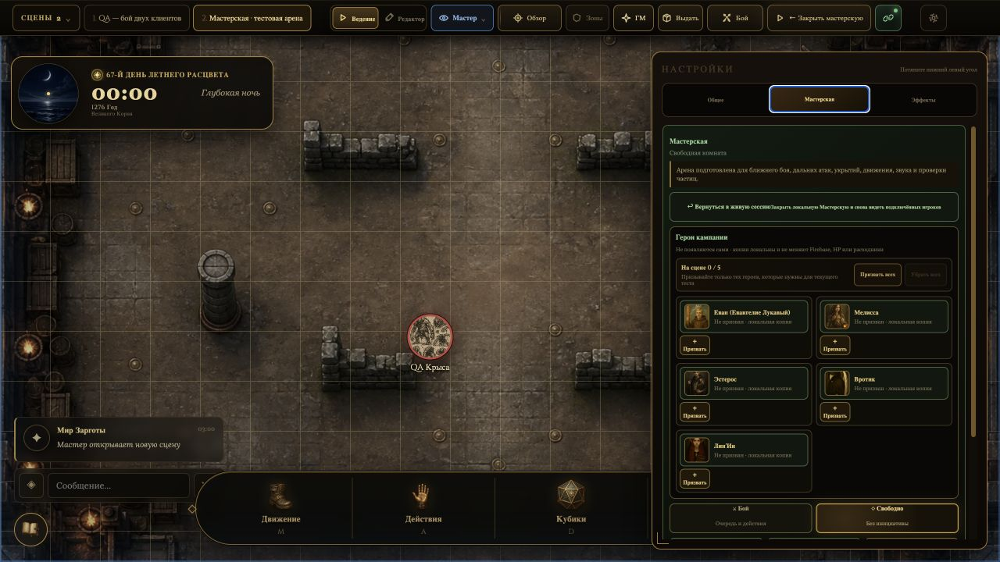

# Мастерская — визуальный контроль после аварийного исправления

Дата проверки: 13 августа 2026

## Исправленное состояние

- Мастерская открывается без автоматического появления пяти героев: `На сцене 0 / 5`.
- Каждый герой кампании вызывается отдельно кнопкой `Призвать`.
- После призыва карточка показывает состояние управления; герой сразу выбирается на сцене.
- Кнопка сверху однозначно сообщает действие:
  - `← В живую сессию`, если есть открытая живая комната;
  - `← Закрыть мастерскую`, если Мастерская открыта автономно.
- Тестовые герои не считаются подключёнными игроками и не получают серое состояние «офлайн» с крестиком.
- Размеры портретов не менялись: настольный вариант `82 × 76 px`, компактный `70 × 66 px`.

## Решение, оставленное на согласование

### Перемещение токена в режиме ведения

Сейчас безопасная последовательность такая:

1. ПКМ по токену.
2. `Переместить жетон`.
3. Перетащить токен левой кнопкой.

Это защищает мастера от случайного сдвига существ во время сессии. В режиме редактора прямое перетаскивание остаётся доступным.

Рекомендуемый вариант: оставить текущую защиту и позднее добавить в контекстное меню небольшой визуальный «хват» рядом с действием `Переместить жетон`. Не возвращать постоянный прямой drag в режиме ведения.

## Что проверить вручную с реальным игроком

1. Из живой комнаты нажать запуск игрока и убедиться, что его клиент переходит на опубликованную сцену.
2. Убедиться, что реальный герой занимает сохранённое место своей тестовой копии.
3. Проверить одно перемещение героя через ПКМ → `Переместить жетон`.

Автоматический двухклиентный сценарий и Firebase Rules пройдены. Реальное подключение внешнего браузера этим снимком не подтверждается.
