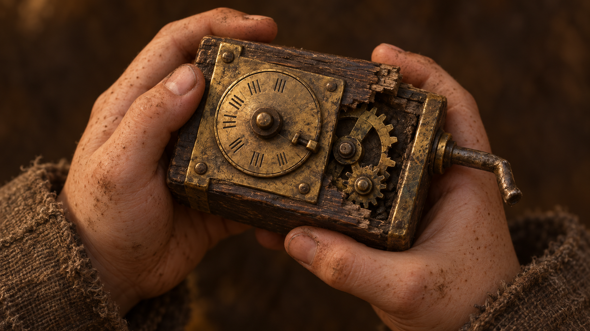
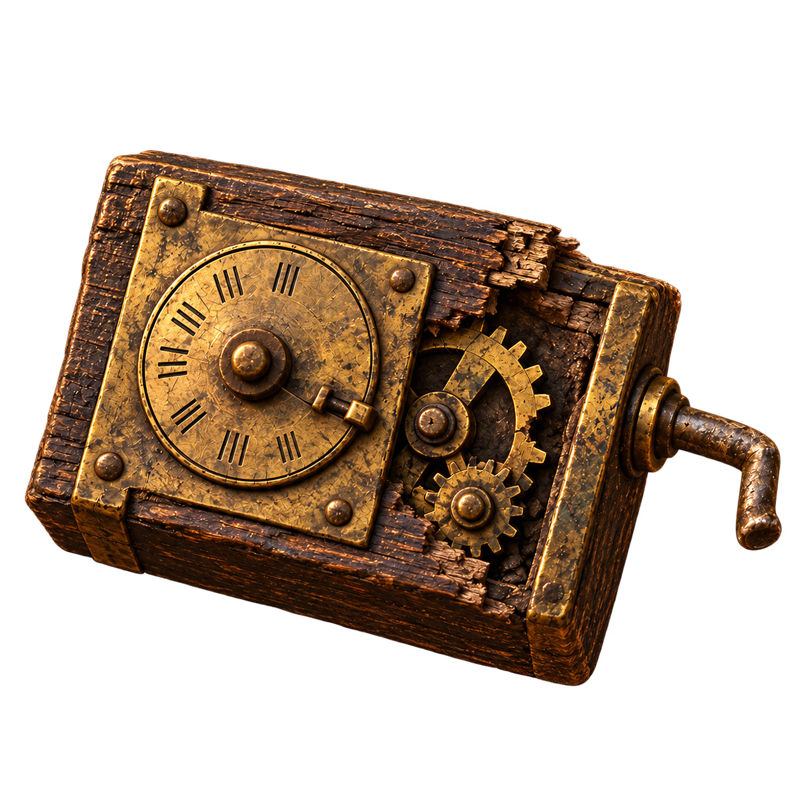
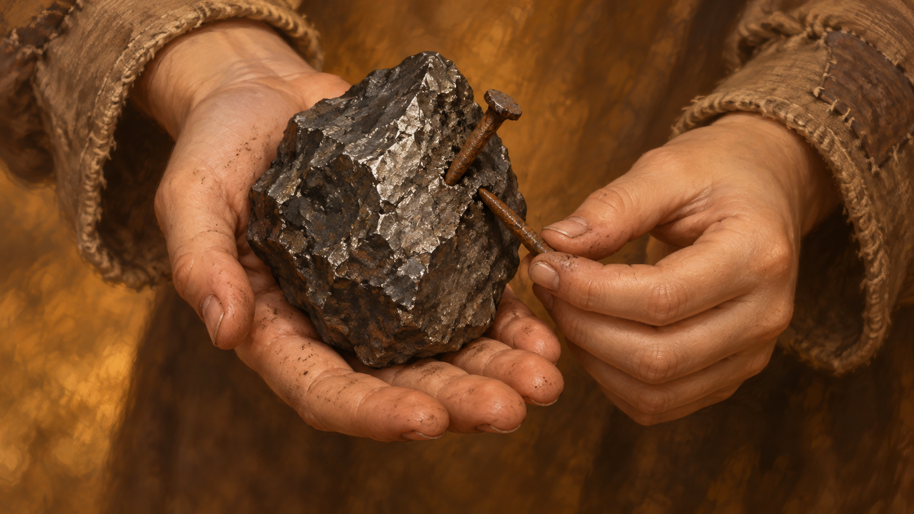
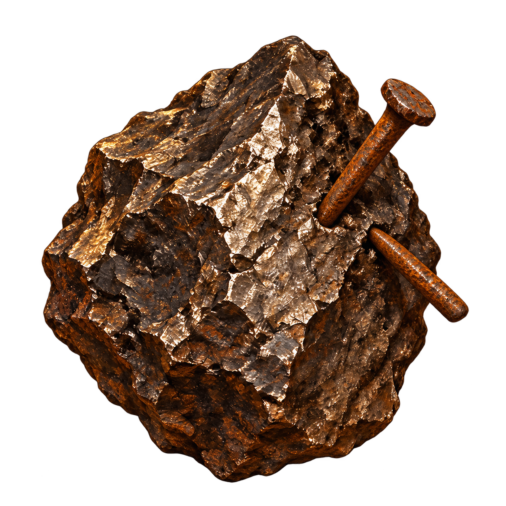

# Предметы дворика v14 / Речі дворика v14

RU: Созданы встроенным ImageGen. Крупные планы подключены к диалогу о находках; иконки и повторный осмотр — к определениям предметов. Предметы не выданы герою. Оригиналы генераций сохранены.

UK: Створено вбудованим ImageGen. Великі плани підключено до діалогу про знахідки; іконки й повторний огляд — до визначень речей. Речі не видано героєві. Оригінали генерацій збережено.

## broken-counter

Inspection: 1672 × 941; icon: 1254 × 1254, alpha.

### Inspection prompt

Use case: illustration-story. Landscape 16:9 fullscreen fantasy RPG item inspection illustration, richly painted warm oil style. Close-up of two slightly dirty freckled child's hands holding a palm-sized BROKEN MECHANICAL WINCH REVOLUTION COUNTER. Humble medieval engineering not modern electronics: rectangular dark oak housing, brass faceplate with one small circular dial with simple engraved tally marks, exposed little bronze gear at the chipped broken corner, bent short spindle on the side. A missing tooth clearly visible on one gear. Old worn practical dock equipment, not ornate steampunk. Rough brown cuff sleeves. Object centered and large, held naturally without hiding mechanism. Only hands and object in view, background indistinct deep warm brown, no face or scenery, no text, no logo. Amber daylight, tactile metal and wood. Readable silhouette.

### Icon prompt

Use case: background-extraction. Create a square fantasy RPG inventory icon of exactly the object in the reference, preserving its recognizable material, structure and palette. Remove ALL hands, sleeves and environment. Show the entire single object centered, occupying 80% of the square with generous safe padding, clean readable silhouette, warm painterly bronze-brown-gold lighting matching the reference. Genuinely transparent alpha background. No frame, no lettering, no badge, no extra objects. Keep the same rectangular broken oak counter with brass dial, exposed gears and small bent spindle.

## lodestone-fragment

Inspection: 1672 × 941; icon: 1254 × 1254, alpha.

### Inspection prompt

Use case: illustration-story. Landscape 16:9 fullscreen fantasy RPG item inspection illustration, richly painted warm oil style. Close-up of a child's long thin slightly dirty hands showing a fist-sized irregular dark charcoal grey LODESTONE FRAGMENT on open palm, with exactly two small rusty iron nails clinging to one side by natural magnetism. Other hand lightly steadies one nail. Stone rough dense natural mineral with subtly metallic fracture surfaces, no glowing magic, no jewels, not a horseshoe magnet. Plain patched brown linen sleeve cuffs. Only hands and object, large central composition, no face, no buildings, indistinct warm brown backdrop. Amber daylight, warm ochre reflected highlights consistent with fantasy dialogue portraits. No text, no logo.

### Icon prompt

Use case: background-extraction. Create a square fantasy RPG inventory icon of exactly the object in the reference, preserving its recognizable material, structure and palette. Remove ALL hands, sleeves and environment. Show the entire single object centered, occupying 80% of the square with generous safe padding, clean readable silhouette, warm painterly bronze-brown-gold lighting matching the reference. Genuinely transparent alpha background. No frame, no lettering, no badge, no extra objects. Keep the same rough dark lodestone fragment and exactly two rusty iron nails adhering to it.

