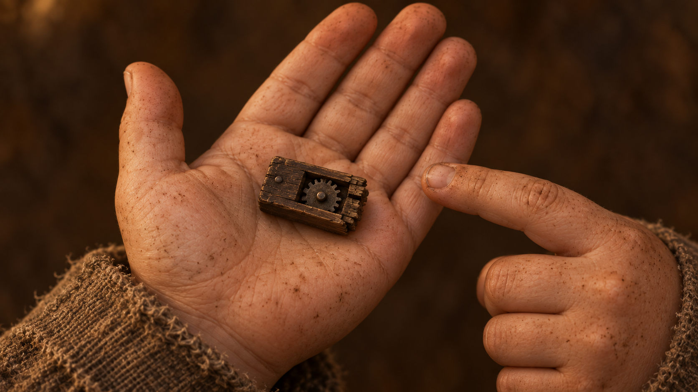
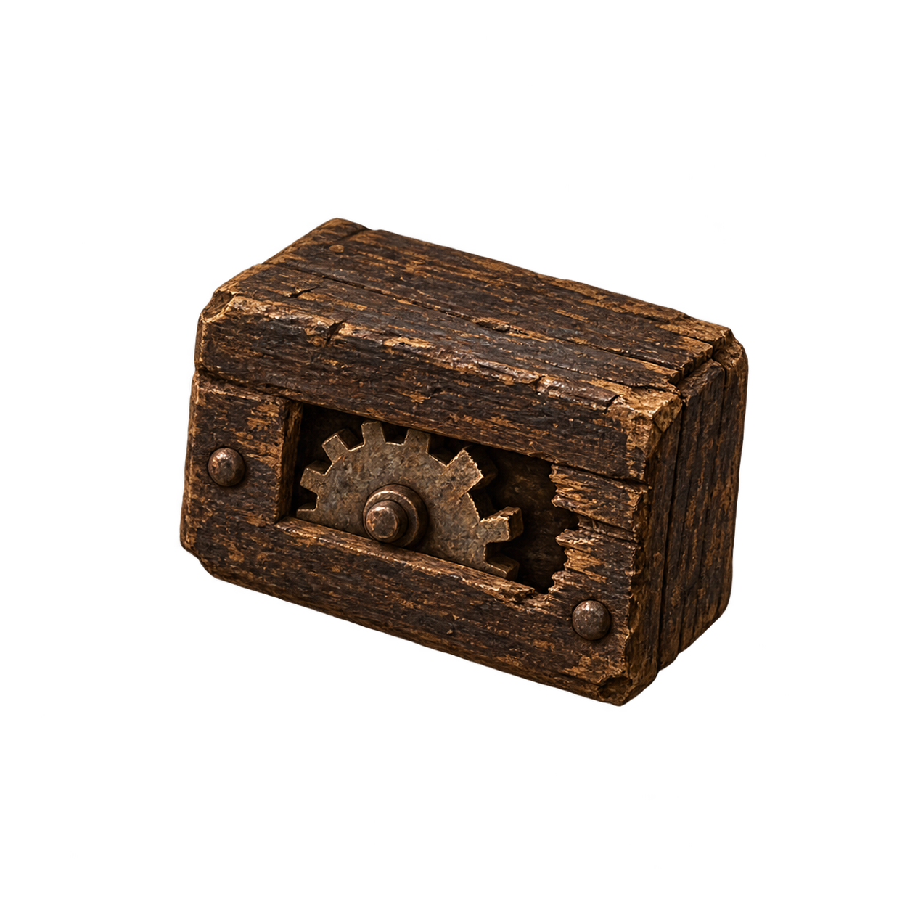
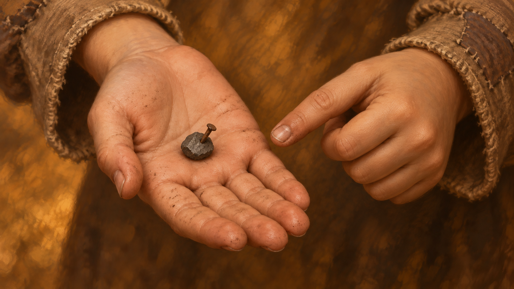
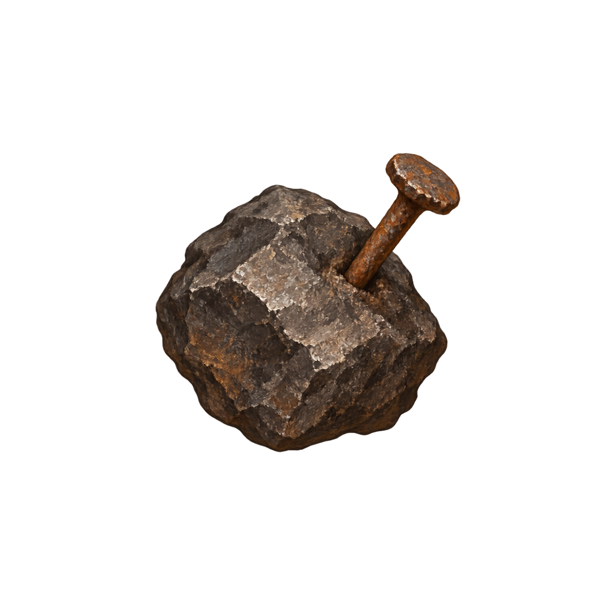

# Маленькие предметы v15 / Маленькі речі v15

RU: Предметы уменьшены относительно ладони и упрощены. Иконки прозрачные. Прежние версии сохранены. Изменения описаний согласованы в RU/UK по чек-листу диалогов. Использован встроенный ImageGen.

UK: Речі зменшено відносно долоні та спрощено. Іконки прозорі. Попередні версії збережено. Зміни описів узгоджено в RU/UK за переліком перевірок діалогів. Використано вбудований ImageGen.

## broken-counter / inspection

Use case: precise-object-edit. Reference provides the old object to redesign MUCH SMALLER AND SIMPLER. A tiny crude broken mechanical counter, only 3 centimeters wide, fits on two fingertips, about ONE QUARTER the original width. Plain worn dark wood rectangular housing, one small dull iron notched wheel visible through a narrow slit with a broken tooth, tiny pin axle. No brass faceplate, no big clock dial, no ornate gears, no crank handle, no gold shine. Just cheap salvaged dock scrap, drastically simpler than reference. Landscape 16:9 illustration. Show the tiny item resting in the middle of ONE open child's palm with plenty of bare palm visible all around, other hand pointing nearby for scale. Preserve warm painterly fantasy style, rough beige cuff, muted brown background without scenery. Whole palm and fingers visible; do NOT enlarge the object to fill the hand. Only hands and tiny item. No text, no modern parts, no dramatic gleaming treasure treatment. Warm hand-painted oil fantasy illustration.

## broken-counter / icon

Use case: precise-object-edit. Reference provides the old object to redesign MUCH SMALLER AND SIMPLER. A tiny crude broken mechanical counter, only 3 centimeters wide, fits on two fingertips, about ONE QUARTER the original width. Plain worn dark wood rectangular housing, one small dull iron notched wheel visible through a narrow slit with a broken tooth, tiny pin axle. No brass faceplate, no big clock dial, no ornate gears, no crank handle, no gold shine. Just cheap salvaged dock scrap, drastically simpler than reference. Square inventory icon of this NEW SIMPLIFIED tiny item, isolated on genuinely transparent background, no hands, no scene, no frame. Clean simple readable silhouette, muted warm brown and charcoal, little fine surface detail. Object occupies central 60% of canvas. No text, no modern parts, no dramatic gleaming treasure treatment. Warm hand-painted oil fantasy illustration.

## lodestone-fragment / inspection

Use case: precise-object-edit. Reference provides the old object to redesign MUCH SMALLER AND SIMPLER. A tiny unremarkable matte dark grey magnetic pebble fragment only 2 centimeters across, like a small walnut chip, ONE QUARTER the original width. A SINGLE tiny rusty tack clings to it. Ordinary rough stone, few broad surfaces, not crystalline, not shiny, no precious ore or golden facets. Cheap pocket find. Landscape 16:9 illustration. Show the tiny item resting in the middle of ONE open child's palm with plenty of bare palm visible all around, other hand pointing nearby for scale. Preserve warm painterly fantasy style, rough beige cuff, muted brown background without scenery. Whole palm and fingers visible; do NOT enlarge the object to fill the hand. Only hands and tiny item. No text, no modern parts, no dramatic gleaming treasure treatment. Warm hand-painted oil fantasy illustration.

## lodestone-fragment / icon

Use case: precise-object-edit. Reference provides the old object to redesign MUCH SMALLER AND SIMPLER. A tiny unremarkable matte dark grey magnetic pebble fragment only 2 centimeters across, like a small walnut chip, ONE QUARTER the original width. A SINGLE tiny rusty tack clings to it. Ordinary rough stone, few broad surfaces, not crystalline, not shiny, no precious ore or golden facets. Cheap pocket find. Square inventory icon of this NEW SIMPLIFIED tiny item, isolated on genuinely transparent background, no hands, no scene, no frame. Clean simple readable silhouette, muted warm brown and charcoal, little fine surface detail. Object occupies central 60% of canvas. No text, no modern parts, no dramatic gleaming treasure treatment. Warm hand-painted oil fantasy illustration.

