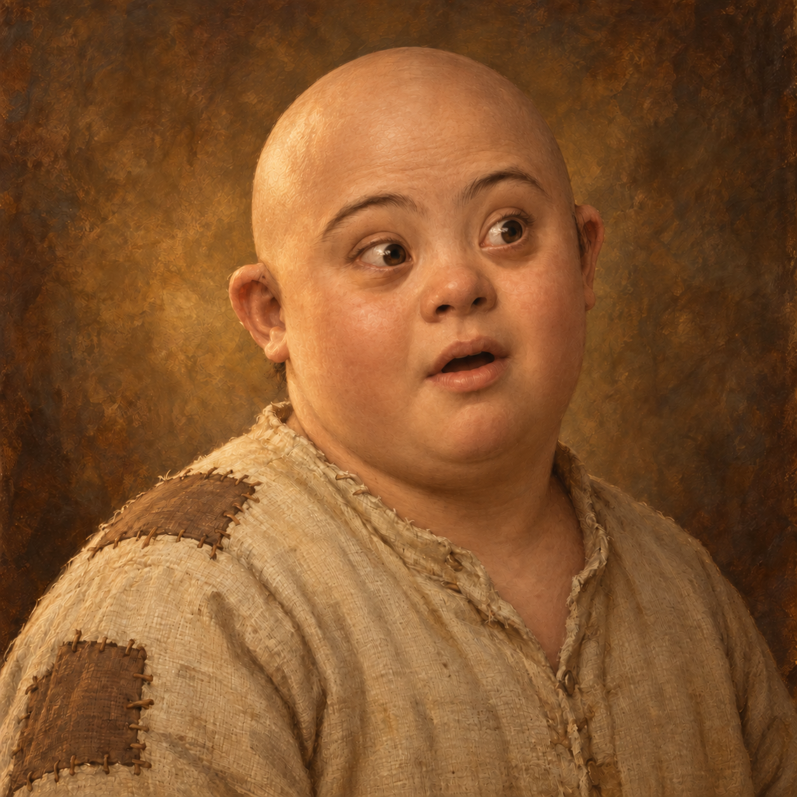

# Мило: эмоции / Мило: емоції

RU: Пять эмоций и базовый портрет. Взят второй лысый вариант; эпизод не изменён. Оригиналы сохранены. Генерация: встроенный ImageGen.

UK: П’ять емоцій і базовий портрет. За основу взято другий варіант без волосся; епізод не змінено. Оригінали збережено. Генерація: вбудований ImageGen.

## neutral

Source: /Users/merkov/.codex/generated_images/01a07bb9-469f-7e63-9422-849a12ef4bb8/exec-437b4c09-f4fa-4f5f-846c-b5db3334d91e.png

## speaking

Source: /Users/merkov/.codex/generated_images/01a07bb9-469f-7e63-9422-849a12ef4bb8/exec-c848e9d4-d733-4d3b-a255-4eff005d735d.png

## laughing

Source: /Users/merkov/.codex/generated_images/01a07bb9-469f-7e63-9422-849a12ef4bb8/exec-259a38f4-66d6-44ed-8c6c-60cdb7d4b85c.png

## surprised

Source: /Users/merkov/.codex/generated_images/01a07bb9-469f-7e63-9422-849a12ef4bb8/exec-1891bdd0-5e68-4cbf-b5af-2e8149eef319.png

## angry

Source: /Users/merkov/.codex/generated_images/01a07bb9-469f-7e63-9422-849a12ef4bb8/exec-0bd3ffe3-e288-40a3-8a23-64b02e8a9f39.png

## sad

Source: /Users/merkov/.codex/generated_images/01a07bb9-469f-7e63-9422-849a12ef4bb8/exec-148339d1-bcf3-4605-bbd7-dc7102884e85.png

## Generation prompts

### speaking

Use case: identity-preserve. Edit target is the attached fantasy portrait of Milo. Create one dialogue emotion portrait of exactly this same fictional 12-year-old boy. Change ONLY facial expression to: Mid-sentence, lips gently parted with natural speech shape, engaged attentive eyes, slightly raised eyebrows. Strictly preserve facial identity, facial proportions, natural Down syndrome features, fully bald scalp, plump cheeks, fuller neck and shoulders, brown eyes, age, same three-quarter head pose toward viewer right, same camera framing and scale, beige patched linen shirt with identical seams and patches, warm ochre textured background, lighting and traditional oil painting rendering. Respectful natural characterization. No hands, no props, no text, no border, no collage. Square image.

### laughing

Use case: identity-preserve. Edit target is the attached fantasy portrait of Milo. Create one dialogue emotion portrait of exactly this same fictional 12-year-old boy. Change ONLY facial expression to: Genuine cheerful laughter, broad smile with naturally visible teeth, lifted cheeks and gently narrowed happy eyes. No tongue protruding. Strictly preserve facial identity, facial proportions, natural Down syndrome features, fully bald scalp, plump cheeks, fuller neck and shoulders, brown eyes, age, same three-quarter head pose toward viewer right, same camera framing and scale, beige patched linen shirt with identical seams and patches, warm ochre textured background, lighting and traditional oil painting rendering. Respectful natural characterization. No hands, no props, no text, no border, no collage. Square image.

### surprised

Use case: identity-preserve. Edit target is the attached fantasy portrait of Milo. Create one dialogue emotion portrait of exactly this same fictional 12-year-old boy. Change ONLY facial expression to: Clear surprise, raised eyebrows, eyes a little wider, mouth slightly open in a small oh shape. Strictly preserve facial identity, facial proportions, natural Down syndrome features, fully bald scalp, plump cheeks, fuller neck and shoulders, brown eyes, age, same three-quarter head pose toward viewer right, same camera framing and scale, beige patched linen shirt with identical seams and patches, warm ochre textured background, lighting and traditional oil painting rendering. Respectful natural characterization. No hands, no props, no text, no border, no collage. Square image.

### angry

Use case: identity-preserve. Edit target is the attached fantasy portrait of Milo. Create one dialogue emotion portrait of exactly this same fictional 12-year-old boy. Change ONLY facial expression to: Upset and determined, brows drawn together, lips pressed, serious firm gaze. Restrained natural anger, not a grimace. Strictly preserve facial identity, facial proportions, natural Down syndrome features, fully bald scalp, plump cheeks, fuller neck and shoulders, brown eyes, age, same three-quarter head pose toward viewer right, same camera framing and scale, beige patched linen shirt with identical seams and patches, warm ochre textured background, lighting and traditional oil painting rendering. Respectful natural characterization. No hands, no props, no text, no border, no collage. Square image.

### sad

Use case: identity-preserve. Edit target is the attached fantasy portrait of Milo. Create one dialogue emotion portrait of exactly this same fictional 12-year-old boy. Change ONLY facial expression to: Quiet sadness, inner eyebrows slightly raised, mouth corners lowered, softly downcast eyes, no tears. Keep head angle unchanged. Strictly preserve facial identity, facial proportions, natural Down syndrome features, fully bald scalp, plump cheeks, fuller neck and shoulders, brown eyes, age, same three-quarter head pose toward viewer right, same camera framing and scale, beige patched linen shirt with identical seams and patches, warm ochre textured background, lighting and traditional oil painting rendering. Respectful natural characterization. No hands, no props, no text, no border, no collage. Square image.

